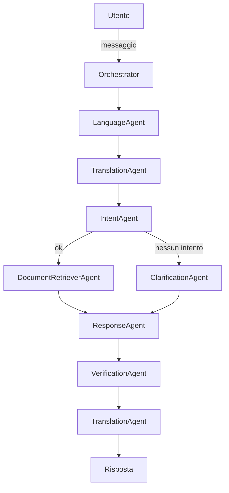

# Kchat

Chatbot agentico per l'assistenza clienti. Il progetto fornisce una serie di agenti modulari che operano completamente in locale sfruttando modelli serviti tramite Ollama. Le funzionalità comprendono gestione ticket, recupero documenti, generazione di preventivi e interazione multilingua.

## Intenti supportati

| **Intent**                    | **Descrizione**                                              | **Esempio utente**                                      |
| ----------------------------- | ------------------------------------------------------------ | -------------------------------------------------------- |
| `technical_support_request`   | L'utente ha un problema tecnico con un prodotto o servizio esistente | *"Il mio dispositivo non si accende più, potete aiutarmi?"* |
| `product_information_request` | L'utente chiede informazioni dettagliate su un prodotto o servizio   | *"Questo modello supporta il Bluetooth?"*               |
| `cost_estimation`               | L'utente vuole un preventivo o informazioni su prezzi                | *"Mi potete fare un preventivo per XXX modello?"*       |
| `booking_or_schedule`         | Richiesta di fissare un appuntamento o una demo                       | *"Vorrei fissare un incontro con un tecnico"*           |
| `document_request`            | L'utente chiede un documento o un manuale                             | *"Potrei avere il manuale in PDF?"*                     |
| `open_ticket`                 | L'utente chiede esplicitamente di aprire un ticket                   | *"Aprite un ticket per favore"*                         |
| `complaint`                   | L'utente esprime un reclamo formale                                 | *"Il prodotto è arrivato danneggiato"*                  |
| `generic_smalltalk`           | Input non classificabile (saluti, test, ecc.)                        | *"Ciao, è previsto qualche evento?"*                    |

## Introduzione

Kchat è concepito per funzionare interamente in locale senza dipendenze da servizi cloud. Ogni messaggio utente viene analizzato e gestito da più agenti specializzati che cooperano tramite il contesto condiviso `AgentContext` (`agents/context.py`). I modelli LLM sono serviti da Ollama e permettono l'elaborazione in più lingue.

### Installazione rapida

Per poter eseguire correttamente i test (`pytest`, `ruff .`, `mypy .`) è
necessario installare prima tutte le dipendenze elencate in
`requirements.txt` (ad esempio `python-json-logger`, `python-docx`,
`openpyxl`, `qdrant-client`). L'esecuzione dei test senza questi pacchetti
fallirà.

```bash
pip install -r requirements.txt
```

## Architettura ad Agenti

Gli agenti principali sono:
- **LanguageAgent** – identifica la lingua e il tono del messaggio.
- **TranslationAgent** – traduce testo e risposte quando necessario.
- **IntentAgent** – classifica l'intento dell'utente tramite regole e modelli.
- **DocumentRetrieverAgent** – recupera documenti pertinenti dal database locale.
- **ResponseAgent** – genera la risposta finale, eventuali azioni e citazioni.
- **VerificationAgent** – convalida la risposta generata.
- **ClarificationAgent** – pone domande di chiarimento in caso di dubbio.
- **OrchestratorAgent** – coordina la sequenza di agenti da eseguire.

## Workflow 

Di seguito è riportato il flusso standard orchestrato da `OrchestratorAgent`.



Il diagramma mostra la sequenza tipica: il messaggio passa per l'identificazione della lingua, l'eventuale traduzione, la classificazione dell'intento e il recupero documentale. La risposta viene quindi verificata e tradotta nella lingua desiderata.

### Schema di memoria condivisa

Tutti gli agenti leggono e scrivono dati nel medesimo `AgentContext`:

```json
{
  "user_id": "abc123",
  "session_id": "sess-456",
  "input": "User message here",
  "language": "it",
  "intent": "cost_estimation",
  "confidence": 0.84,
  "documents": [...],
  "response": "Final LLM response",
  "clarification_attempted": true
}
```

## Mappatura dei log

Ogni agente scrive log dedicati nella cartella `logs/`:

| File di log               | Modulo                             |
| ------------------------- | ---------------------------------- |
| `orchestration_trace.log` | `agents/orchestrator_agent.py`     |
| `lang_log.log`            | `agents/language_agent.py`         |
| `translation_log.log`     | `agents/translation_agent.py`      |
| `intent_log.log`          | `agents/intent_agent.py`           |
| `retrieval_log.log`       | `agents/document_retriever_agent.py` |
| `chat_log.log`            | `agents/response_agent.py`         |
| `clarification_log.log`   | `agents/clarification_agent.py`    |
| `validation_log.log`      | `agents/verification_agent.py`     |
| `quotation_log.log`       | `agents/quotation_agent.py`        |
| `ingest_log.log`          | `agents/embedding_ingestor_agent.py` |
| `action_log.log`          | `agents/action_agent.py`           |
| `supervisor_log.log`      | `agents/supervisor_agent.py`       |
| `pipeline_<pid>.log`      | `knowledge_pipeline/logging_config.py` |

Ogni record include campi aggiuntivi come `confidence_score`, `source_reliability`, `clarification_attempted` ed `error_flag` grazie al sistema di logging definito in `utils/logger.py`.


## Pipeline di ingestione della conoscenza

Il modulo `knowledge_pipeline` sostituisce il vecchio pacchetto di categorizzazione e permette di scansionare directory o archivi ZIP generando chunk arricchiti pronti per l'indicizzazione.

### Utilizzo da riga di comando

```bash
python knowledge_pipeline.py percorso_documenti --output risultato.jsonl
```
La pipeline riconosce le seguenti categorie principali:
- `tech_assistance`
- `software_assistance`
- `product_price`
- `product_guide`

Se non viene indicato `--output`, il file predefinito è `knowledge_base_reliable.jsonl`. I documenti vengono classificati tramite LLM, suddivisi in chunk e arricchiti con riassunti e possibili domande. I file problematici o con classificazioni poco affidabili vengono copiati nella cartella `quarantine/` insieme a un file con il motivo della quarantena.

Il log dettagliato dell'esecuzione è scritto in `logs/pipeline_<pid>.log`. Ogni riga dell'output JSON Lines contiene `chunk_id`, `content` e `metadata` (es. `category`, `classification_confidence`, `chunk_summary`).
## Gestione CSV

Per analizzare file CSV dalla struttura non prevedibile è disponibile il modulo
`utils/csv_utils.py` che offre due funzioni principali:

- `load_csv(path)`: carica il file tramite Pandas restituendo una lista di
  dizionari, generando nomi di colonna automatici se mancanti.
- `summarize_csv(path)`: usa `call_mistral` per produrre una breve descrizione
  delle colonne presenti.

## Come eseguire il debug

1. **Esecuzione interattiva**: avviare `python main.py` e interagire con il bot dalla console. I log saranno salvati in `logs/`.
2. **Modalità test**: eseguire `pytest -vv` per lanciare i test unitari. In caso di errore si può aggiungere l'opzione `-s` per vedere l'output dettagliato.
3. **PDB**: inserire `import pdb; pdb.set_trace()` nel codice da analizzare oppure avviare l'applicazione con `python -m pdb main.py`.
4. **Analisi dei log**: consultare i file in `logs/` per verificare la sequenza dei passi e individuare errori marcati con `error_flag`.

Per la verifica statica del codice sono disponibili i seguenti comandi:

```bash
ruff .
mypy .
pytest
```

L'esecuzione di tali strumenti aiuta a intercettare errori di stile, problemi di tipizzazione e test falliti.

## Requisiti di Sistema
- Python >= 3.9

## Setup Ambiente Virtuale
```bash
# Creare ambiente virtuale
python -m venv venv

# Attivare ambiente virtuale
source venv/bin/activate  # Linux/Mac
.\venv\Scripts\activate   # Windows

# Installare dipendenze
pip install -r requirements.txt
```
