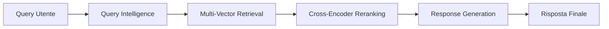

# 🎵 K-Array Expert Chat System

Sistema di chat avanzato per informazioni tecniche sui prodotti K-Array con intelligenza artificiale **zero-allucinazioni** e architettura completamente dinamica.

## 🚀 Quick Start

### 1. **Installazione Dipendenze**

```bash
# Clone del repository (se necessario)
cd /path/to/retrival

# Installa le dipendenze Python
pip install -r requirements.txt
```

### 2. **Configurazione API Keys**

Crea un file `.env` nella root del progetto:

```bash
# Copia il template
cp .env.example .env

# Modifica il file .env con le tue API keys
nano .env
```

Contenuto `.env`:
```env
# API Keys (almeno una richiesta)
GEMINI_API_KEY=your_gemini_api_key_here
OPENAI_API_KEY=your_openai_api_key_here

# Configurazione LLM
DEFAULT_LLM_PROVIDER=gemini  # o "openai"

# Vector Store (opzionale - usa mock se non configurato)
CHROMA_PERSIST_DIRECTORY=./data/chroma_db
```

### 3. **Setup Sistema (Prima Esecuzione)**

```bash
# Inizializza configurazioni dinamiche
python3 src/dynamic_config.py

# Setup vector store e verifica configurazione
python3 setup_chat.py
```

### 4. **Avvio Sistema Chat**

```bash
# Lancia il sistema di chat
python3 k_array_chat.py
```

🌐 **Il sistema sarà disponibile su**: http://localhost:7860

## 📋 Dipendenze

### **Dipendenze Obbligatorie**
```
gradio>=4.0.0
google-generativeai>=0.3.0
openai>=1.0.0
python-dotenv>=1.0.0
requests>=2.31.0
```

### **Dipendenze Opzionali (Performance Avanzate)**
```bash
# Per reranking cross-encoder (migliora qualità)
pip install sentence-transformers

# Per vector store Milvus (performance superiori)
pip install pymilvus

# Per embedding locali
pip install transformers torch
```

## ⚙️ Configurazione Avanzata

### **File di Configurazione**

Il sistema usa configurazioni dinamiche in:

- `config/dynamic_config.json` - Configurazione principale
- `config/domain_knowledge.json` - Conoscenza prodotti K-Array

### **Esempio dynamic_config.json**

```json
{
  "retrieval": {
    "exact_product_weight": 0.25,
    "qa_pairs_weight": 0.20,
    "technical_specs_weight": 0.18,
    "enable_semantic_expansion": true
  },
  "server": {
    "host": "0.0.0.0",
    "port": 7860,
    "debug": true
  },
  "llm": {
    "default_temperature": 0.7,
    "enable_query_intelligence": true
  }
}
```

### **Personalizzazione Prodotti**

Modifica `config/domain_knowledge.json` per aggiungere nuovi prodotti K-Array:

```json
{
  "product_series": {
    "kommander": ["ka02i", "ka04", "ka08", "ka102", "ka104"],
    "lyzard": ["kz1", "kz7", "kz14", "kz26"],
    "nuova_serie": ["nuovo_prodotto1", "nuovo_prodotto2"]
  }
}
```

## 🧪 Testing

### **Test Completi**
```bash
# Test sistema query intelligence
python3 test_query_intelligence.py

# Test integrazione completa
python3 test_integration.py

# Test singoli componenti
python3 test_phase1.py  # Vector store
python3 test_phase2.py  # Reranking
python3 test_phase3.py  # Multi-vector
```

### **Test Rapido Funzionalità**
```bash
# Verifica configurazione
python3 -c "from src.config import Config; print('✅ Config OK')"

# Test LLM connectivity
python3 -c "from src.llm_manager import LLMManager; llm = LLMManager(); print('✅ LLM OK')"
```

## 🏗️ Architettura Sistema

### **Componenti Principali**

```
📁 K-Array Chat System
├── 🧠 Query Intelligence Layer (LLM-powered)
│   ├── Rilevazione linguistica automatica
│   ├── Analisi intent dinamica
│   └── Ottimizzazione query
├── 🔍 Multi-Vector Retrieval (6 strategie)
│   ├── Exact Product Match
│   ├── QA Pairs
│   ├── Technical Specs
│   ├── Semantic Chunks
│   ├── Searchable Content
│   └── Hybrid Search
├── 🎯 Cross-Encoder Reranking
├── 💾 Vector Store (Milvus/ChromaDB)
└── 🤖 Response Engine (Zero-hallucination)
```

### **Flusso Dati**



## 🛠️ Comandi Utili

### **Gestione Sistema**
```bash
# Riavvia con configurazioni aggiornate
python3 k_array_chat.py

# Forza refresh conoscenza dominio
python3 -c "from src.query_intelligence import QueryIntelligenceEngine; QueryIntelligenceEngine().get_domain_knowledge(force_refresh=True)"

# Aggiorna pesi retrieval
python3 -c "from src.dynamic_config import dynamic_config; dynamic_config.update_retrieval_weights({'exact_product_weight': 0.3})"
```

### **Monitoring e Debug**
```bash
# Visualizza logs
tail -f data/chat_system.log

# Verifica statistiche vector store
python3 -c "from src.enhanced_vector_store import EnhancedVectorStore; print(EnhancedVectorStore().get_stats())"
```

## 🔧 Troubleshooting

### **Problemi Comuni**

#### ❌ **"API key not found"**
```bash
# Verifica file .env
cat .env | grep API_KEY

# Verifica variabili ambiente
echo $GEMINI_API_KEY
```

#### ❌ **"Milvus connection failed"**
```bash
# Sistema usa fallback automatico a mock
# Per Milvus locale:
docker run -d --name milvus -p 19530:19530 milvusdb/milvus:latest
```

#### ❌ **"CrossEncoder not available"**
```bash
# Installa dipendenze opzionali
pip install sentence-transformers
```

#### ❌ **"Configuration file not found"**
```bash
# Ricrea configurazioni
python3 src/dynamic_config.py
```

### **Performance Tuning**

#### 🚀 **Ottimizzazione Velocità**
```json
// config/dynamic_config.json
{
  "retrieval": {
    "enable_semantic_expansion": false,
    "enable_reranking": false
  }
}
```

#### 🎯 **Ottimizzazione Qualità**
```json
{
  "retrieval": {
    "exact_product_weight": 0.35,
    "enable_semantic_expansion": true,
    "semantic_weight": 0.8
  }
}
```

## 📊 Monitoraggio

### **Metriche Disponibili**
- Confidence score retrieval
- Numero strategie attivate
- Tempo risposta LLM
- Qualità reranking
- Cache hit ratio

### **Dashboard Gradio**
Il sistema include un dashboard integrato con:
- 📈 Statistiche sistema in tempo reale
- 🔍 Info retrieval per query
- ⚙️ Stato configurazioni
- 🧠 Provider LLM attivo

## 🔒 Sicurezza

### **Best Practices Implementate**
- ✅ API keys mai esposte nei log
- ✅ Validazione input robusto
- ✅ Configurazione sensibile protetta
- ✅ Fallback sicuri per tutte le dipendenze

### **Configurazione Produzione**
```json
{
  "server": {
    "host": "0.0.0.0",
    "debug": false,
    "share": false
  }
}
```

## 🆘 Supporto

### **Documentazione Avanzata**
- `CLAUDE.md` - Guida sviluppatore
- `SYSTEM_VERIFICATION_REPORT.md` - Report tecnico completo

### **Esempi Query**
- "Quali sono le specifiche del Kommander KA104?"
- "Prodotti consigliati per installazioni in hotel"
- "Differenze tra serie Lyzard e Vyper"
- "Come installare sistemi per teatri?"

### **Contatti**
Per supporto tecnico o segnalazione bug, consulta la documentazione o crea un issue nel repository.

---

## 🎯 **Sistema Pronto!**

Con questa configurazione hai un sistema K-Array Chat completamente funzionale con:
- 🧠 **Intelligenza LLM avanzata**
- 🔍 **Retrieval multi-strategia**
- ⚙️ **Configurazione dinamica**
- 🛡️ **Zero-hallucination garantito**
- 🚀 **Performance ottimizzate**

**Buon utilizzo del sistema K-Array Expert Chat!** 🎵